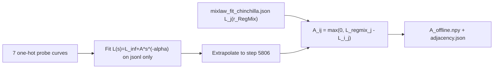

# Skill-It Probe + Dual-Arm 370M Plan

## Locked decisions

- **Probe model:** DataDecide-60M (same as mixlaw pilots)
- **Probe budget:** 5 tpp → **1451 steps / 285,278,208 tokens** (training ends at 1451; step-law fits use in-run evals through **1440** only)
- **Step-law / Chinchilla:** `extrapolate_chinchilla.py` fits on `task_loss.jsonl` only; `task_loss_final.json` @ 1451 is **not** used (different eval protocol; see mixlaw README)
- **A offline:** `A_ij = max(0, L_j(r_RegMix,chin) - L_j(i,chin))` using Chinchilla-extrapolated (tpp=20, step **5806**) family losses; `L_j(r_RegMix)` from `mixlaw_fit_chinchilla.json` at RegMix base weights (same as mixlaw mix01 / `DOMAIN_BASE_WEIGHTS`)
- **A online:** recompute `A(r)` from `[mixlaw/mixlaw_fit_chinchilla.json](experiments/skill-dag/mixlaw/mixlaw_fit_chinchilla.json)` via the mixing-law derivative (see **Mixing-law derivative** below; not LightGBM)
- **Skill-It:** eta=0.2, w=1; start at RegMix weights; updates at steps **500, 875, 1250, 1625, 2000**
- **Full runs:** OLMo2-370M, 10B tokens, curriculum-matching hparams; stream from **published edullm-data** with time-varying domain weights
- **Platform:** no AWS/FarmShare/GPU SKU hardcoding; `NPROC=1` → python, `NPROC>1` → `torchrun`
- **Ephemeral scratch:** empty run dirs OK; stage pools from `edullm-data`; require `TRAIN_VENV` (prebuilt GPU env / image with torch + olmo-core); checkpoints/progress/evals remain on scratch and upload to W&B

## Mixing-law derivative (Skill-It-compatible)

Parametric mixing law (one row per task family `j`, domain weights `r`):

```text
L_j(r) = c_j + k_j * exp( sum_i t_ij * r_i )
```

Partial derivative with respect to domain weight `r_i` (chain rule on the exponential):

```text
dL_j / dr_i = t_ij * k_j * exp( sum_k t_kj * r_k )
            = t_ij * ( L_j(r) - c_j )
```

Skill-It treats `A_ij > 0` as “domain i helps task j.” Helpful domains have **negative** `t_ij` (increasing `r_i` lowers loss). Therefore both arms use:

```text
A_ij = max( 0, -(dL_j / dr_i) ) = max( 0, -t_ij * (L_j(r) - c_j) )
```

evaluated at the **current** domain weights `r` for the online (`skillit-deriv`) arm. (Raw `dL/dr` would invert Skill-It.) Fitted parameters `(c_j, k_j, t_ij)` come from `mixlaw_fit_chinchilla.json`; `skillit_math.py::online_A_from_mixlaw_fit` implements the formula above.

---

## Phase 0 — Repo layout

`[experiments/skill-dag/](experiments/skill-dag/)` is the parent experiment directory. After the mixlaw reorganization it contains:

- `[mixlaw/](experiments/skill-dag/mixlaw/)` — existing 24-mixture pilot (DataDecide-60M, mixing-law fits, validation tooling)
- `[skillit/](experiments/skill-dag/skillit/)` — **new** Skill-It probes + 370M arms (sibling of `mixlaw/`, not nested inside it)

New code under `[experiments/skill-dag/skillit/](experiments/skill-dag/skillit/)`:

- `skillit/probes.json` — 7 one-hot mixture definitions (schema 2, olmohq stream)
- `skillit/prepare_skillit_probe_data.py` — per-probe `mix_weights.json` sidecars
- `skillit/build_adjacency.py` — Chinchilla-extrapolate probes → write `A_offline.npy` + JSON
- `skillit/skillit_math.py` — Shared: softmax update, offline A load, online derivative A from mixlaw fit
- `skillit/skillit_train_recipe.json` — 370M dual-arm recipe (initial RegMix weights, olmohq source)
- `skillit/prepare_skillit_370m_data.py` — per-arm `arm_weights.json` sidecars
- `skillit/submit_skillit_train_pool.sh` / `submit_skillit_370m.sh` — FarmShare pool + training
- `skillit/train_skillit_370m.py` — OLMo2-370M trainer (fork of curriculum control path)
- `skillit/launch_probe.sh` — Platform-agnostic probe launcher
- `skillit/launch_arm.sh` — Platform-agnostic 370M arm launcher
- `skillit/README.md` — Contract, schedules, artifact policy

Reuse from sibling `[experiments/skill-dag/mixlaw/](experiments/skill-dag/mixlaw/)` (import or subprocess; do not duplicate):

- `mixlaw_common.py` — domains, curve families, token budget math, `DOMAINS`, `CURVE_FAMILIES`
- `domain_stream.py` — olmohq domain-stratified sampler (`set_weights` for 370M)
- `recipe_data.py` / `olmo_domain_stream_patch.py` — shared recipe + 60M OLMo stream hook
- `train_datadecide_60m.py` — 60M training (`--pool-dir` + `--mix-weights-json`)
- `eval_task_loss.py` — post-run 6-family eval
- `extrapolate_chinchilla.py` — step-law extrapolation to Chinchilla step 5806
- `run_mixture.sh` — launch pattern reference
- `mixlaw_fit_chinchilla.json` — parametric mixing-law fit for online-derivative arm

Update `[experiments/skill-dag/README.md](experiments/skill-dag/README.md)` to list `skillit/` alongside `mixlaw/`.

---

## Phase 1 — Probe runs (7× DataDecide-60M one-hot)

### Architecture (exact pilot match)

From `[mixlaw/mixlaw_common.py](experiments/skill-dag/mixlaw/mixlaw_common.py)`:

- d_model / layers / heads: **384 / 16 / 12**
- mlp_ratio / seq_len: **8 / 2048**
- Global batch: **96 sequences** (196,608 tok/step)
- LR: **5.8e-3** (CosWithWarmupAndDecay)
- Non-emb params: **57,078,144**
- Tokenizer: dolma2 (100,352 embed rows)
- Init: random (`InitFnType.normal`, std=0.02)
- tpp: **5** → 1451 steps

### Mixtures (`skillit/probes.json`)

Domain order: `dclm, arxiv, starcoder, pes2o, open-web-math, algebraic-stack, wiki` (same as `mixlaw/DOMAINS`).

- `probe_dclm` … `probe_wiki` — one-hot per domain

No uniform 1/7 probe: offline **A** compares each one-hot domain to **RegMix** via the mixing-law reference `L_j(r_RegMix)` (not `probe_uni`).

### Data

- Source: published `s3://edullm-data/pretrain/olmo-127b/v1` (via `edullm_data.read`; never `edullm-datasets`)
- Recipe sidecars: `prepare_skillit_probe_data.py` → `<work>/<probe_id>/mix_weights.json`
- Train: `POOL_DIR` (must include `edullm_data_source.json`) + `MIX_WEIGHTS_JSON` via `launch_probe.sh`
- Checkpoints/progress/evals: runtime scratch, uploaded synchronously to the probe's W&B run
- GPU env: set `TRAIN_VENV` explicitly — no hardcoded ladder scratch venv

### Evals (exact mixlaw pilot match)

Skill-It probes call [`mixlaw/train_datadecide_60m.py`](experiments/skill-dag/mixlaw/train_datadecide_60m.py) with the same defaults as [`mixlaw/run_mixture.sh`](experiments/skill-dag/mixlaw/run_mixture.sh) — no overrides.

**In-run curve eval (for Chinchilla step-law fitting):**

- **Labels:** 6 `CURVE_TASK_LOSS_LABELS` (ARC challenge/easy val + 4 MMLU val families)
- **`eval_interval`:** **120** training steps
- **`eval_subset_batches`:** **4** (max batches per label per eval; keeps in-run eval cheap)
- **`device_eval_batch_size`:** **32**
- **Points per 1451-step run:** **~12** curve points (steps 120, 240, …, **1440**)
- **Output:** `progress/task_loss.jsonl` (one row per eval step; scraped by `TaskLossHandler`)

Do **not** pass `--full-task-suite-in-run` or `--skip-eval` on probe runs.

**Post-training eval (reporting only — not used for step-law fit):**

- Once at end of training via [`mixlaw/eval_task_loss.py`](experiments/skill-dag/mixlaw/eval_task_loss.py) on the final checkpoint (step **1451**)
- Same 6 curve labels (default; not `--full-suite`)
- Output: `progress/task_loss_final.json`
- **Not** appended to the Chinchilla step-law fit: it uses a different eval protocol (full eval vs `eval_subset_batches=4` in-run) and often disagrees with the last in-run point at step 1440 (notably `mmlu_stem`). Step laws use **jsonl points only**, then extrapolate to step **5806** (tpp=20) via [`mixlaw/extrapolate_chinchilla.py`](experiments/skill-dag/mixlaw/extrapolate_chinchilla.py).

**Not run on probes:** the full 20-label ladder suite (that is reserved for 370M arms at checkpoint saves).

### Launch

`skillit/launch_probe.sh` streams from `POOL_DIR` at one-hot recipe weights (`MIX_WEIGHTS_JSON`). Calls `mixlaw/train_datadecide_60m.py` with `olmo_domain_stream_patch`.

---

## Phase 2 — Build offline A (7x6)



1. Reuse `[mixlaw/extrapolate_chinchilla.py](experiments/skill-dag/mixlaw/extrapolate_chinchilla.py)` logic per probe / per `CURVE_FAMILIES` member → losses at step **5806** (tpp=20).
2. Evaluate `L_j(r_RegMix)` from `[mixlaw/mixlaw_fit_chinchilla.json](experiments/skill-dag/mixlaw/mixlaw_fit_chinchilla.json)` at RegMix base weights (`base_weights` in `probes.json`).
3. `skillit/build_adjacency.py`:
  - `A_ij = max(0, L_j(r_RegMix) - L_j(i))` for domains i, families j
  - Write `skillit/artifacts/A_offline.npy` (shape 7x6), `adjacency.json` (named rows/cols + reference losses)
4. Preserve the generated JSON/NPY on runtime scratch and upload it to W&B with the probe-analysis run.

### Measured A matrices (7 one-hot probes, Chinchilla step 5806)

From the July 2026 FarmShare probe array (`skillit-probes-20260729-112123`). Rows = source domain **i** (one-hot probe); columns = task family **j**. Positive **A_ij** means domain **i** is projected to beat the reference on family **j** at Chinchilla scale (tpp=20, step **5806**).

**RegMix reference losses** `L_j(r_RegMix)` from `mixlaw_fit_chinchilla.json` at `base_weights`:

| Family | L_j(RegMix) |
|--------|-------------|
| arc_challenge | 1.546 |
| arc_easy | 2.001 |
| mmlu_humanities | 1.731 |
| mmlu_other | 2.467 |
| mmlu_social_sciences | 1.305 |
| mmlu_stem | 2.297 |

#### Offline A (`skillit-probe` arm)

One-hot probes extrapolated to step 5806; reference = RegMix mixing-law losses.

```text
A_ij = max(0, L_j(r_RegMix) - L_j(i,chin))
```

| domain ↓ / family → | arc_ch | arc_easy | mmlu_hum | mmlu_oth | mmlu_soc | mmlu_stem |
|---------------------|--------|----------|----------|----------|----------|-----------|
| dclm | 0.341 | 0.149 | 0.368 | 0 | 0.079 | 0.486 |
| arxiv | 0.006 | 0 | 0 | 0 | 0 | 0.340 |
| starcoder | 0 | 0 | 0 | 0 | 0 | 0 |
| pes2o | 0.252 | 0.084 | 0 | 0 | 0 | 0.450 |
| open-web-math | 0 | 0 | 0 | 0 | 0 | 0.232 |
| algebraic-stack | 0.017 | 0 | 0 | 0 | 0 | 0.242 |
| wiki | 0.227 | 0 | 0.470 | 0.013 | 0 | 0.352 |

Artifacts: `skillit/artifacts/probes_full/A_offline.npy`, `A_offline.json`. Curves: `task_loss_chinchilla_by_family.png`. Recompute: `python skillit/build_adjacency.py` or `python skillit/plot_probe_chinchilla_results.py`.

---

## Phase 3 — Full experimental arms (2x OLMo2-370M)

### Shared training contract (match curriculum)

From `[train_curriculum_regmix_370m.py](experiments/curriculum/train_curriculum_regmix_370m.py)` / control:

- Model: `TransformerConfig.olmo2_370M` (d=1024, 16L, 16H)
- Seq / GBS: 2048 / **4,194,304** tokens
- Microbatch: 32 seqs/rank (`--device-batch-size`)
- Steps: **2384** (10,000,058,051 // GBS)
- Optim: SkipStepAdamW, LR **4e-4**, warmup **24**, `alpha_f=1.0` (constant after warmup)
- Seed: **42**
- Checkpoints: every **125** steps + 0 + 2384; omit 2375
- Task loss: **all 20** ladder bpb labels at every permanent checkpoint, synchronously on every rank via pause/free/eval/reload. Production is fail-closed.

### Domain sampling (edullm-data recipe + live reweight)

Do **not** use fixed RegMix-10B concat shuffle (weights baked into corpus sizes).

- **Recipe:** `skillit_train_recipe.json` — RegMix initial weights, two arms (`skillit-probe`, `skillit-deriv`), pinned source `pretrain/olmo-127b/v1` (the same published source family as the MixLaw reference).
- **Provenance:** staged pools and arm/probe sidecars must record exactly `pretrain/olmo-127b/v1`. Both `edullm_data_source.json` and the older `_EDULLM_DATA_SOURCE.json` marker name are accepted only when their identities agree.
- **Pool:** stage once via `submit_skillit_train_pool.sh` or let `submit_skillit_370m.sh` submit a CPU stage job into `${RUN_DIR}/pool` from edullm-data. No assumed persistent scratch pool.
- **Env:** set `TRAIN_VENV` to a prebuilt GPU Python with torch + olmo-core (this repo does not bake a CUDA install into the submit script).
- **Stream:** `DomainMixtureStream` over the pool; at each step draw domain ~ `p_t`, then a random 2048-token chunk. Mid-run Skill-It updates call `set_weights(p)` — no new corpora.
- **Artifacts:** runtime scratch plus the arm's W&B run; SkillIt does not write checkpoints, progress, evals, or analysis artifacts to S3

### Arms (only A differs)

- `skillit-probe` — Fixed offline A from Phase 2
- `skillit-deriv` — Recompute `A(r_t)` from `mixlaw/mixlaw_fit_chinchilla.json` at current `r_t` (= `p_before`) before each update, using the mixing-law derivative:

```text
dL_j / dr_i = t_ij * ( L_j(r) - c_j )
A_ij        = max( 0, -(dL_j / dr_i) )
```

Both:

1. **Steps 0–499:** `p` = RegMix base weights
  `(0.375, 0.25, 0.1406, 0.0938, 0.0635, 0.0615, 0.0156)`
2. **At steps 500, 875, 1250, 1625, 2000** (after that step’s 20-label eval):
  - Read 6 curve-family losses `L_j(f_t)` from the checkpoint eval
  - Build / load A (7x6)
  - Update (w=1):

```text
p_i(t+1)  proportional to  exp( eta * sum_j A_ij * L_j(f_t) )
eta = 0.2
```

- Softmax over 7 domains; apply from the **next** step onward

1. **Persist every update** (both arms; required for post-hoc review):
  - Append one JSONL record to `progress/skillit_updates.jsonl` with:
    - `step`, `arm_id`, `a_mode` (`probe` | `derivative`)
    - `losses`: dict of the 6 curve-family bpb values used in the update
    - `A`: full 7x6 matrix as nested lists, plus `domain_order` and `family_order`
    - `p_before`: domain weights in effect before this update
    - `p_after`: domain weights after softmax (used from next step)
    - For `derivative` only: `r` at which `dL/dr` was evaluated (equals `p_before`)
  - Also write a per-update snapshot file for easy inspection:
    - `progress/skillit_updates/step{N}_A.json` — full A with named rows/cols
    - `progress/skillit_updates/step{N}_weights.json` — `p_before`, `p_after`, losses
  - At step 0 (train start), write the initial RegMix `p` once to the same JSONL / `step0_weights.json` (A may be the offline matrix or the derivative at RegMix `r`, recorded for baseline comparison even though no weight change occurs yet)
2. Upload `progress/skillit_updates.jsonl` and `progress/skillit_updates/` with the other arm artifacts to W&B; the local copies remain on runtime scratch.

### Trainer hook

`train_skillit_370m.py` forks the curriculum trainer’s model/optim/checkpoint/task_loss path; replace data stream with `DomainMixtureStream(p)` that accepts `set_weights(p)` at update steps. Single- and multi-GPU via same grad-accum / HSDP pattern as curriculum (`NPROC` in `launch_arm.sh`).

### Launch

```bash
# 1. Optional: stage pool alone (or skip — submit_skillit_370m.sh can stage)
bash experiments/skill-dag/skillit/submit_skillit_train_pool.sh

# 2. Train both arms (explicit recovery mode + eval config required)
RESUME_MODE=fresh TRAIN_VENV=/path/to/gpu-venv \
  LADDER_BASE_CONFIG=/path/to/compatible-config.yaml \
  bash experiments/skill-dag/skillit/submit_skillit_370m.sh

# Single arm, local (auto-stages pool into sibling of PROGRESS_DIR if missing)
NPROC=1 RESUME_MODE=fresh ARM_ID=skillit-probe A_MODE=probe \
  ARM_WEIGHTS_JSON=$WORK/skillit-probe/arm_weights.json \
  LADDER_BASE_CONFIG=/path/to/compatible-config.yaml \
  POOL_DIR=... SAVE_FOLDER=... PROGRESS_DIR=... \
  bash experiments/skill-dag/skillit/launch_arm.sh
```

Slurm submit scripts: `submit_skillit_train_pool.sh`, `submit_skillit_370m.sh`. Recipe prep: `prepare_skillit_370m_data.py`. Offline A default: `artifacts/probes_full/A_offline.npy`.

Resume is never inferred from local scratch. Set `RESUME_MODE=resume` and provide a local `LOAD_PATH`, or for the dual-arm submitter a `LOAD_PATH_TEMPLATE` containing `{arm_id}`. A legacy S3 step path under `s3://edullm-checkpoints/skillit/<arm>/checkpoints/stepN` may be read once as a bootstrap input at run start; it stages both checkpoint and progress history locally and never writes artifacts back to S3. Prefer restoring a downloaded W&B checkpoint artifact to scratch and passing its local path.

---

## Phase 4 — Analysis artifacts

- Per-arm: checkpoint ladder task_loss JSONs (20 labels), weight trajectories, final macro curve-6
- Per-arm Skill-It logs (required):
  - `progress/skillit_updates.jsonl` — one record per update with full `A` (7x6) and `p_before` / `p_after`
  - `progress/skillit_updates/step{N}_A.json` and `step{N}_weights.json` — same data as discrete files
  - Offline arm: A is constant across updates but still re-saved each time so both arms have identical log schemas
  - Derivative arm: A changes with `r`; each update’s A is independently recoverable
- Compare `skillit-probe` vs `skillit-deriv` vs existing RegMix control (`curriculum` control / token-selection control) on the 6 Skill-It families and full 20-label suite
- Small script `skillit/plot_weights.py` for `p_t` trajectories (reads `skillit_updates.jsonl`)

---

## Implementation order

1. `skillit/probes.json` + `prepare_skillit_probe_data.py` (recipe sidecars; edullm-data stream)
2. Run 7 one-hot probes via `mixlaw/train_datadecide_60m.py`; extrapolate via `mixlaw/extrapolate_chinchilla.py`; `skillit/build_adjacency.py` → offline A vs RegMix
3. `skillit/skillit_math.py` (update + derivative A from `mixlaw/mixlaw_fit_chinchilla.json`) unit-tested against toy numbers
4. `skillit/domain_stream.py` + `skillit/train_skillit_370m.py` + launch scripts
5. Update `experiments/skill-dag/README.md`; launch two 370M arms; upload scratch artifacts to W&B

---

## Artifact durability and S3 boundary

S3 is restricted to staging or streaming published training data and optional bootstrap inputs at run start. SkillIt never writes checkpoints, progress, evals, logs, or analysis artifacts to S3.

Production runs require `WANDB_MODE=online`, a valid `WANDB_API_KEY`, and the `wandb` package. Every permanent checkpoint is uploaded as a W&B model artifact and the trainer waits for W&B acknowledgement before advancing; an upload failure terminates all ranks. Eval JSON and Skill-It update snapshots are also W&B artifacts, and the final non-W&B scratch tree is uploaded as `runtime-artifacts`.

`ALLOW_LOCAL_ONLY=1` is an explicit smoke-test escape hatch that permits offline or disabled W&B. It does not change the scientific schedule or create an S3 artifact path; all outputs remain on runtime scratch.

---

## Out of scope

- LightGBM surrogates for A (`mixlaw/mixlaw_fit_lightgbm_chinchilla.json`)
- Pairwise (i,j) vs j-only probing
- Behavioral clustering
- Changing LR schedule, GBS, or checkpoint ladder relative to curriculum

