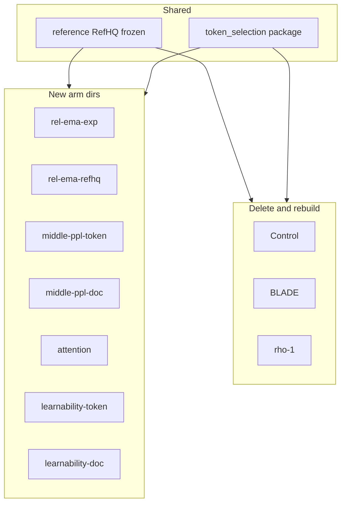

# Token-selection experiment plan (all arms)

## Shared architecture (drop-in compatible with RefHQ)

Every arm’s **trainable** model must be an exact architectural match to the finished RefHQ CE model so weights are drop-in compatible for averaging / dual-ref swaps. Canonical source: `[reference/train_olmo3_370m_refhq.py](experiments/token-selection/reference/train_olmo3_370m_refhq.py)`.


- **Config factory**: `TransformerConfig.olmo2_370M` (**not** `olmo3_370M` / SWA)
- **`d_model` / layers / heads**: 1024 / 16 / 16
- **Block**: `reordered_norm`
- **MLP**: gated SiLU FFN, hidden 4096
- **Attention**: **full** (no sliding window); QK-RMSNorm; RoPE θ = 500_000
- **Vocab / tokenizer**: 100_352 / `allenai/dolma2-tokenizer`
- **Params**: ~371M non-embedding / ~474M total
- **Sequence length**: 2048
- **Global batch tokens**: `4_194_304`
- **Rank microbatch tokens**: `65_536` (32 sequences; grad accum 64 on 1 GPU)
- **Optim**: SkipStepAdamW + CosWithWarmup
- **Peak LR / warmup**: `4e-4` / 24 steps
- **`alpha_f`**: 0.1 (match RefHQ trainer)
- **`z_loss_multiplier`**: `1e-5`
- **`max_grad_norm`**: 1.0
- **Compile**: `compile_model=True` (same as RefHQ)
- **Init**: **from scratch** for all RegMix main runs (`init_seed` aligned with contract)
- **DP**: HSDP bf16 train module (same stack as RefHQ / current control+BLADE)


**Frozen references** (RHO, learnability, REL-RefHQ seed) load RefHQ checkpoints into this same module shape only.

**Do not change** the already-trained RefHQ weights; they are the fixed reference. New arms must match them.

## Shared checkpoint contract (all arms)

Permanent ladder only — **no ephemeral pruning**:

- Save at **step 0** (pre-train / init snapshot)
- Save every **125 steps** on the grid: 125, 250, …, `125 * floor(total_steps / 125)`
- Always save the **true final step**
- **Skip the last on-grid step** when it falls within one interval of the final step (i.e. if `final - last_grid < 125`, omit `last_grid`). This avoids a near-duplicate snapshot right before the end.
- `max_checkpoints=None` — keep **every** save permanently
- Format: same as each trainer’s existing full state (`model_and_optim` / `full_state_dict_v1` as used by that arm), but cadence and retention are mandatory for all

Example for a 2360-step run (`125 * 18 = 2250`, and `2360 - 2250 = 110 < 125`):

`{0, 125, 250, …, 2125, 2360}` — **omit 2250**

Enforce this in every arm trainer (standalone scripts and the shared `token_selection` spine). All arms use this 125-step permanent ladder (no ephemeral checkpoints).

## Hardware / launch contract (all scripts)

All train, data-prep, and eval scripts must be **single-GPU and multi-GPU compatible** with **no hardcoded hardware assumptions**:

- Discover world size from `torchrun` / `LOCAL_RANK` / `WORLD_SIZE` (or 1 if unset); never require a fixed GPU count.
- Do not hardcode `CUDA_VISIBLE_DEVICES`, specific GPU indices (e.g. GPU7), node names, or machine-specific scratch paths as required defaults.
- Paths (data, checkpoints, reference `.pt`, outputs) come from CLI/env/YAML; document examples without baking FarmShare or AWS hosts into required code paths.
- Batching: keep **global** batch tokens = `4_194_304`; derive per-rank microbatch / grad-accum from `world_size` (must divide evenly). Fail fast with a clear error if not divisible.
- Eval scripts: run on 1+ GPUs the same way (DDP optional; single-GPU must work).

## Task-loss eval contract (OLMo-ladder bpb)

**Definition** (not accuracy, not train CE, not raw LM perplexity):

```text
task_loss_bpb = -log2 p(gold continuation | context) / utf8_bytes(continuation)
```

Negative log-likelihood of the **correct answer continuation** under multiple-choice RC **5-shot** prompts, normalized by UTF-8 byte length of that continuation. **Lower is better.**

### Full suite (20 labels, all `*_rc_5shot_bpb`)

- `arc_challenge_val_rc_5shot_bpb`, `arc_challenge_test_rc_5shot_bpb`
- `arc_easy_val_rc_5shot_bpb`, `arc_easy_test_rc_5shot_bpb`
- `boolq_val_rc_5shot_bpb`
- `csqa_val_rc_5shot_bpb`
- `hellaswag_val_rc_5shot_bpb`
- `openbookqa_val_rc_5shot_bpb`, `openbookqa_test_rc_5shot_bpb`
- `piqa_val_rc_5shot_bpb`
- `socialiqa_val_rc_5shot_bpb`
- `winogrande_val_rc_5shot_bpb`
- `mmlu_stem_val_rc_5shot_bpb`, `mmlu_stem_test_rc_5shot_bpb`
- `mmlu_humanities_val_rc_5shot_bpb`, `mmlu_humanities_test_rc_5shot_bpb`
- `mmlu_social_sciences_val_rc_5shot_bpb`, `mmlu_social_sciences_test_rc_5shot_bpb`
- `mmlu_other_val_rc_5shot_bpb`, `mmlu_other_test_rc_5shot_bpb`

### Families (collapse val/test)

`arc_challenge`, `arc_easy`, `boolq`, `csqa`, `hellaswag`, `openbookqa`, `piqa`, `socialiqa`, `winogrande`, `mmlu_stem`, `mmlu_humanities`, `mmlu_social_sciences`, `mmlu_other`.

### Reporting

- Prefer per-label `task_loss_bpb` and/or per-family means (average val+test when both exist).
- Macro-mean over labels/families is fine as a summary only.
- Do **not** substitute accuracy or CE for task loss.

### When to run

**Immediately on every permanent checkpoint save** (including step 0 and final), training pauses until the checkpoint is fully materialized and the full 20-label suite succeeds. The checkpoint, complete eval JSON, progress, and schema-v2 run fingerprint are then uploaded to W&B; production online checkpoint uploads are fail-closed. Only after required uploads succeed may local `last_durable_step.json` advance.

Artifacts from the former 10B/2384-step schedule, partial/legacy eval JSON, or standalone checkpoints without a schema-v2 `run_fingerprint.json` are explicitly **out of contract** and must not be imported as resumable state.

The shared evaluator in `scripts/farmshare/task_loss/eval_task_loss_olmo_core.py` covers all 20 raw labels. Each arm’s synchronous post-save callback evaluates the just-saved step (proxy weights for BLADE); partial suites are rejected rather than treated as contract-complete.

Outputs: per-arm `task_loss_results/<arm>/step{N}_task_loss.json` with the full `task_loss_bpb` map.

## Shared data contract


- **Main train corpus**: published `pretrain/regmix-10b` under `s3://edullm-data/` (resolve via `data.dataset_id` + `edullm_data.read`; stage per job — do not assume FarmShare/laptop scratch tokens persist)
- **Keep fraction**: **k / γ = 0.6**
- **Token budget (main runs)**: one epoch of the published train split (~**9.989B** catalog rows / `resolve_latest` + train `rows`) — configs pin **`max_tokens: 9900000000`** → **2360 steps** at GBS `4_194_304` (under per-shard usable sequences so the loader does **not** wrap to force 10B/2384)
- **Selection-mask warmup**: **None** for online scorers (`t0_steps=0` / `t0_frac=0`); selection active from step 0. **Exception:** BLADE keeps its **500-step** proxy-only warmup (no selection until step 500).
- **Reference (when needed)**: RefHQ 370M step1315 — `s3://edullm-checkpoints/olmo-370m/edullm-370M-refhq-5p5b/checkpoints/step1315/` (materialized at `--launch` from `reference.s3_uri`)
- **Learnability early / late**: RefHQ **step250** vs **avg of step1000/1125/1315**


## Artifact durability and S3 boundary

- S3 may only stage/stream published training data and immutable bootstrap references at run start.
- Checkpoints, progress, metrics, eval JSON, fingerprints, and durable markers stay on runtime scratch and upload to W&B artifacts.
- Production online runs require W&B and wait for each checkpoint artifact upload; failure aborts before training continues.
- `--resume` restores `WANDB_RESUME_ARTIFACT` (or the run's `latest` checkpoint artifact) into scratch, then applies the schema-v2 fingerprint guard.
- `sync_artifacts.py` stages tokens only. The former S3 output helper was removed.

### Recovery and runtime dependencies

- The YAML spine starts fresh without `--resume`; resume restores a W&B artifact and requires a matching schema-v2 fingerprint. Standalone trainers accept `--wandb-resume-artifact` or an explicit local `--load-path`.
- `progress/last_durable_step.json` advances only after the checkpoint and complete task-loss suite are locally valid and required W&B uploads succeed.
- Production online runs require W&B. AWS credentials are only needed for allowed S3 input staging; training code never writes artifacts to S3.

## Per-arm directory layout

Each experiment arm owns scripts under `experiments/token-selection/<arm>/`. Shared library stays in `[token_selection/](experiments/token-selection/token_selection/)` (package only — no arm-specific launch scripts left only there).


- **Control (random 60%)** (`control/`): uniform random keep baseline; retrain under ladder contract
- **BLADE** (`blade/`): **Delete entire dir → rebuild** + retrain
- **RHO-1** (`rho-1/`): **Delete entire dir → rebuild** + retrain from scratch (discard in-progress run)
- **REL no-init exp-α** (`rel-ema-exp/`): **Create new**
- **REL RefHQ-init α=0.9985** (`rel-ema-refhq/`): Code ready; GPU launch still required
- **Middle PPL token** (`middle-ppl-token/`): **Owned** (YAML+launch moved out of shared package)
- **Middle PPL document** (`middle-ppl-doc/`): **Create new** (filter + CE train scripts)
- **Attention** (`attention/`): **Create new**
- **Learnability token** (`learnability-token/`): **Create new**
- **Learnability document** (`learnability-doc/`): **Create new** (filter + CE train scripts)
- **Reference (RefHQ)** (`reference/`): **Leave as-is** (already trained; source of truth for arch)


Each arm dir contains at minimum: `README.md`, train/launch scripts (and FarmShare helpers if needed), and arm YAML pointing at the shared package methods where applicable.




---

## Arm matrix


1. **Control**
   - Selection: uniform random keep 60% (Marion-style; same keep rate as other arms, not “no selection”)
   - Status: Code ready; **GPU retrain required**
   - Action: `control/` rebuilt; new run_id `control-regmix10b-v2`; random 60% keep on RegMix 10B
2. **REL, no init, α=`1−e^(−t/300)`**
   - Selection: top 60% `L_hist−L_curr`
   - Status: Code ready; **GPU run required**
   - Action: `rel-ema-exp/` + exp schedule; bias-corrected EMA from zero
3. **REL, RefHQ init, α=`0.9985`**
   - Selection: top 60% REL
   - Status: Code ready; **GPU run required**
   - Action: `rel-ema-refhq/` + seed EMA from RefHQ step1315; export `.pt` before launch
4. **RHO-1**
   - Selection: top 60% `L_curr−L_ref`
   - Status: Code ready; **GPU retrain from scratch**
   - Action: `rho-1/` rebuilt; discard old ~step200 run; export RefHQ `.pt` before launch
5. **Middle PPL, document**
   - Selection: middle 60% docs by RefHQ PPL
   - Status: Filter+CE ready; **LM labels pending**
   - Action: `middle-ppl-doc/` offline filter → CE after labels READY
6. **Middle PPL, token**
   - Selection: middle 60% by frozen RefHQ `L_ref` (late avg)
   - Status: Code ready; **GPU launch required**
   - Action: `middle-ppl-token/` owns YAML+launch; shared `middle_ppl` scorer
7. **Attention**
   - Selection: top 60% attn received
   - Status: Code ready; **GPU run required**
   - Action: `attention/` + `attention_topk`; FA-safe hook+recompute
8. **Learnability, document**
   - Selection: top 60% largest early→late improvement
   - Status: Filter+CE ready; **LM labels pending**
   - Action: `learnability-doc/` filter → CE after labels READY
9. **Learnability, token**
   - Selection: top 60% `L_early−L_late`
   - Status: Code ready; **GPU run required**
   - Action: `learnability-token/` dual frozen refs; export early/late `.pt` before launch
10. **BLADE**
    - Selection: top 60% dynamic excess
    - Status: Code ready; **GPU retrain required**
    - Action: `blade/` rebuilt with locked schedule (syncs 500/875/1250/1625/2000; K=75; γ=0.6; τ=375; ckpt saves proxy+ref)

---

## Launch order

1. **Layout first:** delete `control/`, `blade/`, and `rho-1/`; create all arm dirs; lock shared arch + ckpt helpers; harden scripts for 1..N GPU.
2. **Shared eval:** expand task-loss evaluator to the full 20-label suite; add post-save hook used by every arm.
3. **Rebuild + launch Control, BLADE, and RHO** (long jobs; RHO from scratch, no resume); evals fire on each checkpoint as it lands.
4. **In parallel (code path):** REL-exp, REL-RefHQ, attention, learnability-token, middle-ppl-token (same immediate-eval wiring).
5. **After LM labels:** doc filters → middle-ppl-doc + learnability-doc CE trains (same eval wiring).

Default compute path: whatever host the user provides via env/CLI (`torchrun` world size). Do **not** submit AWS training unless you explicitly authorize a concrete AWS workload.

---

## Deliverables checklist

- [x] Per-arm directories created; `control/`, `blade/`, and `rho-1/` deleted and rebuilt
- [x] Shared RefHQ-matched architecture documented and enforced in every trainer
- [x] Permanent checkpoint ladder: step 0, every 125 (skip last grid point if within 125 of final), plus final; no ephemeral prune
- [x] All scripts single-GPU and multi-GPU compatible; no hardcoded GPU count / device / host
- [ ] Control, BLADE, and RHO-1 retrained from scratch under new contract (BLADE: syncs 500/875/1250/1625/2000, K=75, γ=0.6, τ=375; ckpts save proxy+ref; RHO: discard old step200 run)
- [x] `rel-ema-exp/` with α=`1−e^(−t/300)` (code; GPU launch pending)
- [x] `rel-ema-refhq/` with α=`0.9985` + RefHQ seed (GPU launch still required)
- [x] `attention/` top-60% attn-received (code; GPU launch pending)
- [x] `learnability-token/` dual-ref early−late (code; GPU launch pending; export `.pt` first)
- [x] `middle-ppl-token/` code ready (GPU launch pending)
- [ ] Doc filters + `middle-ppl-doc/` + `learnability-doc/` CE trains (blocked on LM labels READY)
- [x] Full 20-label OLMo-ladder `task_loss_bpb` evaluator; triggered immediately on every permanent checkpoint
- [x] Online selection arms use `t0=0` (no masking warmup); BLADE keeps 500-step proxy warmup only
- [x] Top-level README arm table updated
- [x] Shared spine: `z_loss_multiplier=1e-5`, `max_grad_norm=1.0`, scratch + W&B artifact durability, FA unwrap, matmul precision